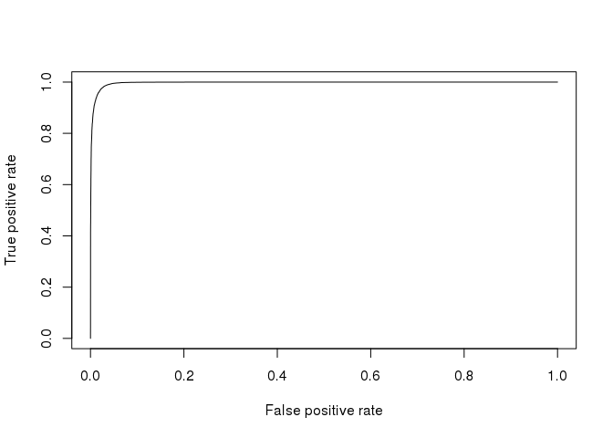

-   [Introduction](#introduction)
-   [Boilerplate](#boilerplate)
-   [Data overview](#data-overview)
    -   [Simple feature separation caracterization :
        LDA](#simple-feature-separation-caracterization-lda)
-   [New Feature creation : Timeseries
    processing](#new-feature-creation-timeseries-processing)
    -   [Simple feature separation caracterization for this timeseries
        derived
        feature](#simple-feature-separation-caracterization-for-this-timeseries-derived-feature)
-   [Simple Model Fitting using temporal derived
    feature](#simple-model-fitting-using-temporal-derived-feature)
-   [To be done](#to-be-done)

Introduction
============

A simple test of creating time based features to enhance classification
performance.

Basically, walking and running should be easy to differenciate by
looking at acceleration variation on several sequencial samples.

Don't hesitate to comment / improve this quick try !

Boilerplate
===========

Loading package and data. Mainly :

-   dplyr / tidyr for data manipulation
-   ggplot2 / ggthemes / gridEXtra for plots
-   MASS / CARET for Classificaton-Regression FW

<!-- -->

    library('MASS')
    library('caret')

    library('ggplot2') # visualization
    library('ggthemes') # visualization
    library('scales') # visualization
    library('plyr'); library('dplyr')
    library('tidyr') # data manipulation
    library('gridExtra')

    library("ROCR")
    library('stringr')
    library('data.table')
    library('zoo')

    #library('DescTools')

    setwd("~/repo/kaggle/walkOrRun/src/")

    set.seed(2017)
    select <- dplyr::select
    options(digits.secs=6)

Data overview
=============

Load dataset :

    df <- fread('../input/dataset.csv', stringsAsFactors=TRUE)
    df <- mutate(df, class = ifelse(df$activity == 0, "Walk", "Run")) %>%
          select(-activity, -date, -time, -username) %>% glimpse()

    ## Observations: 88,588
    ## Variables: 8
    ## $ wrist          <int> 0, 0, 0, 0, 0, 0, 0, 0, 0, 0, 0, 0, 0, 0, 0, 0,...
    ## $ acceleration_x <dbl> 0.2650, 0.6722, 0.4399, 0.3031, 0.4814, 0.4044,...
    ## $ acceleration_y <dbl> -0.7814, -1.1233, -1.4817, -0.8125, -0.9312, -0...
    ## $ acceleration_z <dbl> -0.0076, -0.2344, 0.0722, 0.0888, 0.0359, -0.09...
    ## $ gyro_x         <dbl> -0.0590, -0.1757, -0.9105, 0.1199, 0.0527, 0.69...
    ## $ gyro_y         <dbl> 0.0325, 0.0208, 0.1063, -0.4099, 0.4379, -0.217...
    ## $ gyro_z         <dbl> -2.9296, 0.1269, -2.4367, -2.9336, 2.4922, 2.57...
    ## $ class          <chr> "Walk", "Walk", "Walk", "Walk", "Walk", "Walk",...

    df$class <- as.factor(df$class)

Quick overview of some key parameters :

    df %>% 
      ggplot(aes(x=class, fill=class)) +
      geom_bar()

Small descriptive graph of parameters distribution

    df %>%
        gather( sensor, value, acceleration_x:gyro_z) %>%
        ggplot( aes(x = factor(class), y = value)) + 
        geom_jitter(alpha = 0.1) + geom_boxplot(color = "blue", outlier.colour = NA, fill = NA) +
        facet_wrap(~sensor)

Simple feature separation caracterization : LDA
-----------------------------------------------

Preprocessing step : - Only scale here (TBC)

    intrain   <- createDataPartition(y=df$class , p=0.7, list=FALSE)
    df_train  <- df[intrain,] ; df_test <- df[-intrain,]

    df_train_PP <- preProcess(df_train[names(df_train) != "class"], method = c("scale"))
    df_train_PP <- data.frame(predict(df_train_PP, df_train[names(df_train) != "class"]), class = df_train$class)

Simple feature *a**c**c**e**l**e**r**a**t**i**o**n**x* and
*a**c**c**e**l**e**r**a**t**i**o**n**y* distribution graph
per class :

    p1 <- ggplot(df_train_PP, aes(x = acceleration_x, y = acceleration_y, colour = factor(class))) + 
          geom_point()

    p2 <- gather(df_train_PP, sensor, value, acceleration_x:acceleration_y) %>%
          ggplot(aes(x =value)) + geom_histogram(bins = 100) + 
          facet_grid(. ~ sensor, scales = "free_x")

    grid.arrange(p1, p2)

LDA processing and differenciability :

    r       <- lda(formula = class ~ ., data = df_train_PP)
    plda    <- predict(object = r,  newdata = df_train_PP)
    dataset <- data.frame(class = df_train_PP[,"class"], lda = plda$x)
    ggplot(dataset, aes(x=LD1,colour = class, fill = class)) + geom_density(alpha = 0.1)

New Feature creation : Timeseries processing
============================================

Main idea is to process Data and Time to construct a GMT object,
ordering sample by this GMT and compute a median absolute deviation
(MAD) to caracterize variability of acceleration / gyros parameters.

    windowsSize = 5 
    maxDeltaSecInWindow = 5

    dftps <- fread('../input/dataset.csv', stringsAsFactors=FALSE)
    dftps <- mutate(dftps, class = ifelse(dftps$activity == 0, "Walk", "Run"),
                    secAsFloat =  str_replace(gsub("[0-9]+:[0-9]+:", "", time), ":", "."),
                    gmt =  paste(date, gsub(":[0-9]+:[0-9]+$", "", time), sep='-'),
                    gmt =  paste(gmt, secAsFloat, sep = ':') ,
                    gmt =  as.POSIXct(strptime(gmt, "%Y-%m-%d-%H:%M:%OS"))) %>%
            select(-activity, -username, -secAsFloat, -date, -time) %>% arrange(gmt)

    glimpse(dftps)

    ## Observations: 88,588
    ## Variables: 9
    ## $ wrist          <int> 0, 0, 0, 0, 0, 0, 0, 0, 0, 0, 0, 0, 0, 0, 0, 0,...
    ## $ acceleration_x <dbl> 0.2650, 0.6722, 0.4399, 0.3031, 0.4814, 0.6320,...
    ## $ acceleration_y <dbl> -0.7814, -1.1233, -1.4817, -0.8125, -0.9312, -1...
    ## $ acceleration_z <dbl> -0.0076, -0.2344, 0.0722, 0.0888, 0.0359, -0.29...
    ## $ gyro_x         <dbl> -0.0590, -0.1757, -0.9105, 0.1199, 0.0527, 0.05...
    ## $ gyro_y         <dbl> 0.0325, 0.0208, 0.1063, -0.4099, 0.4379, -0.189...
    ## $ gyro_z         <dbl> -2.9296, 0.1269, -2.4367, -2.9336, 2.4922, 0.44...
    ## $ class          <chr> "Walk", "Walk", "Walk", "Walk", "Walk", "Walk",...
    ## $ gmt            <dttm> 2017-06-30 13:51:15.847723, 2017-06-30 13:51:1...

Determine valid time windows (ie. first gmt - last gmt &lt;
maxDeltaSecInWindow). Here, we take 5 samples windows and min max GMT on
this window must no exceed 5s (conservative).

    windowsSize = 5 
    maxDeltaSecInWindow = 5

Perform rolling variance / rolling MAD on windowSize Timeframe

    dftps$mad_accel_x   <-  rollapply(dftps$acceleration_x, width=windowsSize, FUN=mad, align="center", partial=0)
    dftps$mad_accel_y   <-  rollapply(dftps$acceleration_y, width=windowsSize, FUN=mad, align="center", partial=0)
    dftps$mad_accel_z   <-  rollapply(dftps$acceleration_z, width=windowsSize, FUN=mad, align="center", partial=0)
    dftps$mad_gyro_x    <-  rollapply(dftps$gyro_x, width=windowsSize, FUN=mad, align="center", partial=0)
    dftps$mad_gyro_y    <-  rollapply(dftps$gyro_y, width=windowsSize, FUN=mad, align="center", partial=0)
    dftps$mad_gyro_z    <-  rollapply(dftps$gyro_z, width=windowsSize, FUN=mad, align="center", partial=0)

    dftps               <-  dftps %>%
                            mutate(validity = ifelse(abs(gmt - lag(gmt,windowsSize)) < maxDeltaSecInWindow, 1, 0),
                                   mad_accel_x = ifelse( validity == 1, mad_accel_x, NA),
                                   mad_accel_y = ifelse( validity == 1, mad_accel_y, NA),
                                   mad_accel_z = ifelse( validity == 1, mad_accel_z, NA),
                                   mad_gyro_x = ifelse( validity == 1, mad_gyro_x, NA),
                                   mad_gyro_y = ifelse( validity == 1, mad_gyro_y, NA),
                                   mad_gyro_z = ifelse( validity == 1, mad_gyro_z, NA))
    glimpse(dftps)

    ## Observations: 88,588
    ## Variables: 16
    ## $ wrist          <int> 0, 0, 0, 0, 0, 0, 0, 0, 0, 0, 0, 0, 0, 0, 0, 0,...
    ## $ acceleration_x <dbl> 0.2650, 0.6722, 0.4399, 0.3031, 0.4814, 0.6320,...
    ## $ acceleration_y <dbl> -0.7814, -1.1233, -1.4817, -0.8125, -0.9312, -1...
    ## $ acceleration_z <dbl> -0.0076, -0.2344, 0.0722, 0.0888, 0.0359, -0.29...
    ## $ gyro_x         <dbl> -0.0590, -0.1757, -0.9105, 0.1199, 0.0527, 0.05...
    ## $ gyro_y         <dbl> 0.0325, 0.0208, 0.1063, -0.4099, 0.4379, -0.189...
    ## $ gyro_z         <dbl> -2.9296, 0.1269, -2.4367, -2.9336, 2.4922, 0.44...
    ## $ class          <chr> "Walk", "Walk", "Walk", "Walk", "Walk", "Walk",...
    ## $ gmt            <dttm> 2017-06-30 13:51:15.847723, 2017-06-30 13:51:1...
    ## $ mad_accel_x    <dbl> NA, NA, NA, NA, NA, 0.2232796, 0.2232796, 0.241...
    ## $ mad_accel_y    <dbl> NA, NA, NA, NA, NA, 0.18621456, 0.18621456, 0.3...
    ## $ mad_accel_z    <dbl> NA, NA, NA, NA, NA, 0.18369414, 0.18369414, 0.1...
    ## $ mad_gyro_x     <dbl> NA, NA, NA, NA, NA, 0.09651726, 0.69682200, 0.6...
    ## $ mad_gyro_y     <dbl> NA, NA, NA, NA, NA, 0.28465920, 0.04077150, 0.0...
    ## $ mad_gyro_z     <dbl> NA, NA, NA, NA, NA, 3.031769, 3.031769, 2.79040...
    ## $ validity       <dbl> NA, NA, NA, NA, NA, 1, 1, 1, 1, 1, 1, 1, 1, 1, ...

Simple feature separation caracterization for this timeseries derived feature
-----------------------------------------------------------------------------

    intrain       <- createDataPartition(y=dftps$class , p=0.7, list=FALSE)
    dftps_train   <- dftps[intrain,]  %>% select(-gmt, -validity)
    dftps_test    <- dftps[-intrain,] %>% select(-gmt, -validity)

    dftps_train_PP   <- preProcess(dftps_train[names(dftps_train) != "class"], method = c("scale"))
    dftps_train_PP   <- data.frame(predict(dftps_train_PP, dftps_train[names(dftps_train) != "class"]), class = dftps_train$class)

Simple feature *a**c**c**e**l**e**r**a**t**i**o**n**x* and
*a**c**c**e**l**e**r**a**t**i**o**n**y* distribution graph
per class :

    p1 <- ggplot(dftps_train_PP, aes(x = mad_accel_x, y = mad_accel_y, colour = factor(class))) + 
          geom_point()

    p2 <- gather(dftps_train_PP, sensor, value, mad_accel_x:mad_accel_y) %>%
          ggplot(aes(x =value)) + geom_histogram(bins = 100) + 
          facet_grid(. ~ sensor, scales = "free_x")

    grid.arrange(p1, p2)

    ## Warning: Removed 1163 rows containing missing values (geom_point).

    ## Warning: Removed 2326 rows containing non-finite values (stat_bin).

LDA processing and Run / Walk differenciability :

    r       <- lda(formula = class ~ ., data = dftps_train_PP)
    plda    <- suppressWarnings(predict(object = r,  newdata = dftps_train_PP))

Distribution plot :

    dataset <- data.frame(class = dftps_train_PP[,"class"], lda = plda$x)
    ggplot(dataset, aes(x=LD1, colour = class, fill = class)) + geom_density(alpha = 0.1)

    ## Warning: Removed 1163 rows containing non-finite values (stat_density).

Look nice ;)

Simple Model Fitting using temporal derived feature
===================================================

Simple Logistic Regression (extracted from
<https://www.kaggle.com/pcharambira/logistic-regression-vs-decision-tree>
on the same dataset)

    model_logistic = glm(class ~   acceleration_x +
                                   acceleration_y +
                                   acceleration_z + 
                                   mad_accel_x +        
                                   mad_accel_y +
                                   mad_accel_z +
                                   mad_gyro_x + 
                                   mad_gyro_y + 
                                   mad_gyro_z + 
                                   gyro_x +
                                   gyro_y +
                                   gyro_z ,
                                   family=binomial(link='logit'), control = list(maxit = 50), data=dftps_train_PP)

    ## Warning: glm.fit: fitted probabilities numerically 0 or 1 occurred

    print(summary(model_logistic))

    ## 
    ## Call:
    ## glm(formula = class ~ acceleration_x + acceleration_y + acceleration_z + 
    ##     mad_accel_x + mad_accel_y + mad_accel_z + mad_gyro_x + mad_gyro_y + 
    ##     mad_gyro_z + gyro_x + gyro_y + gyro_z, family = binomial(link = "logit"), 
    ##     data = dftps_train_PP, control = list(maxit = 50))
    ## 
    ## Deviance Residuals: 
    ##     Min       1Q   Median       3Q      Max  
    ## -4.3236  -0.0011   0.0078   0.0813   4.4376  
    ## 
    ## Coefficients:
    ##                Estimate Std. Error z value Pr(>|z|)    
    ## (Intercept)     3.62139    0.14392  25.163  < 2e-16 ***
    ## acceleration_x -0.20376    0.05199  -3.919 8.89e-05 ***
    ## acceleration_y -4.40919    0.09207 -47.887  < 2e-16 ***
    ## acceleration_z  0.50233    0.05603   8.965  < 2e-16 ***
    ## mad_accel_x    -6.98435    0.15380 -45.411  < 2e-16 ***
    ## mad_accel_y    -2.15674    0.05406 -39.893  < 2e-16 ***
    ## mad_accel_z    -3.98568    0.10879 -36.636  < 2e-16 ***
    ## mad_gyro_x      0.23471    0.03393   6.918 4.59e-12 ***
    ## mad_gyro_y      0.25157    0.03054   8.236  < 2e-16 ***
    ## mad_gyro_z     -0.47691    0.03486 -13.680  < 2e-16 ***
    ## gyro_x          0.03679    0.03715   0.990  0.32207    
    ## gyro_y          0.08994    0.03479   2.585  0.00974 ** 
    ## gyro_z         -0.20306    0.03553  -5.716 1.09e-08 ***
    ## ---
    ## Signif. codes:  0 '***' 0.001 '**' 0.01 '*' 0.05 '.' 0.1 ' ' 1
    ## 
    ## (Dispersion parameter for binomial family taken to be 1)
    ## 
    ##     Null deviance: 84355.2  on 60849  degrees of freedom
    ## Residual deviance:  7627.3  on 60837  degrees of freedom
    ##   (1163 observations deleted due to missingness)
    ## AIC: 7653.3
    ## 
    ## Number of Fisher Scoring iterations: 10

    # Apply the algorithm to the training sample
    prediction_training = predict(model_logistic, dftps_train_PP, type = "response")
    prediction_training = ifelse(prediction_training > 0.5, "Walk", "Run")
    error = mean(prediction_training != dftps_train_PP$class)
    print(paste('Model Accuracy after a split along the 0.5 probability',1-error))

    ## [1] "Model Accuracy after a split along the 0.5 probability NA"

    # Get the ROC curve and the AUC
    p = predict(model_logistic, dftps_train_PP, type="response")
    pr = prediction(p, dftps_train_PP$class)
    prf = performance(pr, measure = "tpr", x.measure = "fpr")
    plot(prf)

    auc = performance(pr, measure = "auc")
    auc = auc@y.values[[1]]
    print(paste("General Model Accuracy", auc))

    ## [1] "General Model Accuracy 0.997059224460541"

To be done
==========

-   Better filtering to find 'coherent' time window of variable duration
    (zoo application ?)
-   Automatically determine window size (here, 5 sample length
    is arbitrary)
-   Work on more complex time based feature (MAD is quite a simple one)
-   Work harder on model fitting (here, simple copy / paste from
    <https://www.kaggle.com/pcharambira/logistic-regression-vs-decision-tree>)
