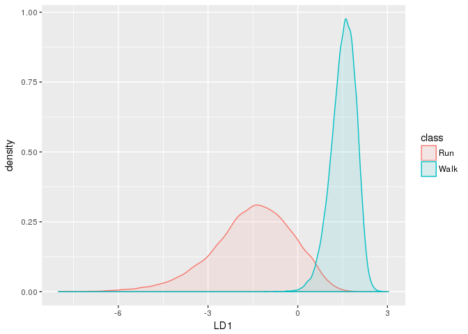

-   [Introduction](#introduction)
-   [Boilerplate](#boilerplate)
-   [Data overview](#data-overview)
    -   [Simple feature separation caracterization :
        LDA](#simple-feature-separation-caracterization-lda)
-   [New Feature creation : Timeseries
    processing](#new-feature-creation-timeseries-processing)
    -   [Simple feature separation caracterization for this timeseries
        derived
        feature](#simple-feature-separation-caracterization-for-this-timeseries-derived-feature)
-   [Model Fitting using temporal derived
    feature](#model-fitting-using-temporal-derived-feature)
-   [Classical GLM :](#classical-glm)

Introduction
============

A simple test of creating time based features to enhance classification
performance.

Basically, walking and running should be easy to differenciate by
looking at acceleration variation on several sequencial samples.

With a radial SVM kernel, classifier accuracy is given at 0.9961137

To be done : \* Better filtering to find 'coherent' time window of
variable duration (zoo application ?) \* Automatically determine window
size (here, 5 sample length is arbitrary) \* Work on more complex time
based feature (MAD is quite a simple one)

Boilerplate
===========

Loading package and data. Mainly :

-   dplyr / tidyr for data manipulation
-   ggplot2 / ggthemes / gridEXtra for plots
-   MASS / CARET for Classificaton-Regression FW

<!-- -->

    library('MASS')
    library('caret')

    library('ggplot2') # visualization
    library('ggthemes') # visualization
    library('scales') # visualization
    library('plyr'); library('dplyr')
    library('tidyr') # data manipulation
    library('gridExtra')

    library('stringr')
    library('data.table')
    library('zoo')

    setwd("~/repo/kaggle/walkOrRun/src/")

    set.seed(2017)
    select <- dplyr::select
    options(digits.secs=6)

Data overview
=============

Load dataset :

    df <- fread('../input/dataset.csv', stringsAsFactors=TRUE)
    df <- mutate(df, class = ifelse(df$activity == 0, "Walk", "Run")) %>%
          select(-activity, -date, -time, -username) %>% glimpse()

    ## Observations: 88,588
    ## Variables: 8
    ## $ wrist          <int> 0, 0, 0, 0, 0, 0, 0, 0, 0, 0, 0, 0, 0, 0, 0, 0,...
    ## $ acceleration_x <dbl> 0.2650, 0.6722, 0.4399, 0.3031, 0.4814, 0.4044,...
    ## $ acceleration_y <dbl> -0.7814, -1.1233, -1.4817, -0.8125, -0.9312, -0...
    ## $ acceleration_z <dbl> -0.0076, -0.2344, 0.0722, 0.0888, 0.0359, -0.09...
    ## $ gyro_x         <dbl> -0.0590, -0.1757, -0.9105, 0.1199, 0.0527, 0.69...
    ## $ gyro_y         <dbl> 0.0325, 0.0208, 0.1063, -0.4099, 0.4379, -0.217...
    ## $ gyro_z         <dbl> -2.9296, 0.1269, -2.4367, -2.9336, 2.4922, 2.57...
    ## $ class          <chr> "Walk", "Walk", "Walk", "Walk", "Walk", "Walk",...

    df$class <- as.factor(df$class)

Quick overview of some key parameters :

    df %>% 
      ggplot(aes(x=class, fill=class)) +
      geom_bar()

Small descriptive graph of parameters distribution

    df %>%
        gather( sensor, value, acceleration_x:gyro_z) %>%
        ggplot( aes(x = factor(class), y = value)) + 
        geom_jitter(alpha = 0.1) + geom_boxplot(color = "blue", outlier.colour = NA, fill = NA) +
        facet_wrap(~sensor)

Simple feature separation caracterization : LDA
-----------------------------------------------

Preprocessing step : - Only scale here (TBC)

    intrain   <- createDataPartition(y=df$class , p=0.7, list=FALSE)
    df_train  <- df[intrain,] ; df_test <- df[-intrain,]

    df_train_PP <- preProcess(df_train[names(df_train) != "class"], method = c("scale"))
    df_train_PP <- data.frame(predict(df_train_PP, df_train[names(df_train) != "class"]), class = df_train$class)

Simple feature *a**c**c**e**l**e**r**a**t**i**o**n**x* and
*a**c**c**e**l**e**r**a**t**i**o**n**y* distribution graph
per class :

    p1 <- ggplot(df_train_PP, aes(x = acceleration_x, y = acceleration_y, colour = factor(class))) + 
          geom_point()

    p2 <- gather(df_train_PP, sensor, value, acceleration_x:acceleration_y) %>%
          ggplot(aes(x =value)) + geom_histogram(bins = 100) + 
          facet_grid(. ~ sensor, scales = "free_x")

    grid.arrange(p1, p2)

LDA processing and differenciability :

    r       <- lda(formula = class ~ ., data = df_train_PP)
    plda    <- predict(object = r,  newdata = df_train_PP)
    dataset <- data.frame(class = df_train_PP[,"class"], lda = plda$x)
    ggplot(dataset, aes(x=LD1,colour = class, fill = class)) + geom_density(alpha = 0.1)

New Feature creation : Timeseries processing
============================================

Main idea is to process Data and Time to construct a GMT object,
ordering sample by this GMT and compute a median absolute deviation
(MAD) to caracterize variability of acceleration / gyros parameters.

    windowsSize = 5 
    maxDeltaSecInWindow = 5

    dftps <- fread('../input/dataset.csv', stringsAsFactors=FALSE)
    dftps <- mutate(dftps, class = ifelse(dftps$activity == 0, "Walk", "Run"),
                    secAsFloat =  str_replace(gsub("[0-9]+:[0-9]+:", "", time), ":", "."),
                    gmt =  paste(date, gsub(":[0-9]+:[0-9]+$", "", time), sep='-'),
                    gmt =  paste(gmt, secAsFloat, sep = ':') ,
                    gmt =  as.POSIXct(strptime(gmt, "%Y-%m-%d-%H:%M:%OS"))) %>%
            select(-activity, -username, -secAsFloat, -date, -time) %>% arrange(gmt)

    glimpse(dftps)

    ## Observations: 88,588
    ## Variables: 9
    ## $ wrist          <int> 0, 0, 0, 0, 0, 0, 0, 0, 0, 0, 0, 0, 0, 0, 0, 0,...
    ## $ acceleration_x <dbl> 0.2650, 0.6722, 0.4399, 0.3031, 0.4814, 0.6320,...
    ## $ acceleration_y <dbl> -0.7814, -1.1233, -1.4817, -0.8125, -0.9312, -1...
    ## $ acceleration_z <dbl> -0.0076, -0.2344, 0.0722, 0.0888, 0.0359, -0.29...
    ## $ gyro_x         <dbl> -0.0590, -0.1757, -0.9105, 0.1199, 0.0527, 0.05...
    ## $ gyro_y         <dbl> 0.0325, 0.0208, 0.1063, -0.4099, 0.4379, -0.189...
    ## $ gyro_z         <dbl> -2.9296, 0.1269, -2.4367, -2.9336, 2.4922, 0.44...
    ## $ class          <chr> "Walk", "Walk", "Walk", "Walk", "Walk", "Walk",...
    ## $ gmt            <dttm> 2017-06-30 13:51:15.847723, 2017-06-30 13:51:1...

Determine valid time windows (ie. first gmt - last gmt &lt;
maxDeltaSecInWindow). Here, we take 5 samples windows and min max GMT on
this window must no exceed 5s (conservative).

    windowsSize = 5 
    maxDeltaSecInWindow = 5

Perform rolling variance / rolling MAD on windowSize Timeframe

    dftps$mad_accel_x   <-  rollapply(dftps$acceleration_x, width=windowsSize, FUN=mad, align="center", partial=0)
    dftps$mad_accel_y   <-  rollapply(dftps$acceleration_y, width=windowsSize, FUN=mad, align="center", partial=0)
    dftps$mad_accel_z   <-  rollapply(dftps$acceleration_z, width=windowsSize, FUN=mad, align="center", partial=0)
    dftps$mad_gyro_x    <-  rollapply(dftps$gyro_x, width=windowsSize, FUN=mad, align="center", partial=0)
    dftps$mad_gyro_y    <-  rollapply(dftps$gyro_y, width=windowsSize, FUN=mad, align="center", partial=0)
    dftps$mad_gyro_z    <-  rollapply(dftps$gyro_z, width=windowsSize, FUN=mad, align="center", partial=0)

    dftps               <-  dftps %>%
                            mutate(temporalValidity = ifelse(abs(gmt - lag(gmt,windowsSize)) < maxDeltaSecInWindow, 1, 0),
                                   temporalValidity = ifelse(is.na(temporalValidity), 0, temporalValidity))
    glimpse(dftps)

    ## Observations: 88,588
    ## Variables: 16
    ## $ wrist            <int> 0, 0, 0, 0, 0, 0, 0, 0, 0, 0, 0, 0, 0, 0, 0, ...
    ## $ acceleration_x   <dbl> 0.2650, 0.6722, 0.4399, 0.3031, 0.4814, 0.632...
    ## $ acceleration_y   <dbl> -0.7814, -1.1233, -1.4817, -0.8125, -0.9312, ...
    ## $ acceleration_z   <dbl> -0.0076, -0.2344, 0.0722, 0.0888, 0.0359, -0....
    ## $ gyro_x           <dbl> -0.0590, -0.1757, -0.9105, 0.1199, 0.0527, 0....
    ## $ gyro_y           <dbl> 0.0325, 0.0208, 0.1063, -0.4099, 0.4379, -0.1...
    ## $ gyro_z           <dbl> -2.9296, 0.1269, -2.4367, -2.9336, 2.4922, 0....
    ## $ class            <chr> "Walk", "Walk", "Walk", "Walk", "Walk", "Walk...
    ## $ gmt              <dttm> 2017-06-30 13:51:15.847723, 2017-06-30 13:51...
    ## $ mad_accel_x      <dbl> 0.2593067, 0.1296534, 0.2028197, 0.2232796, 0...
    ## $ mad_accel_y      <dbl> 0.50690094, 0.25345047, 0.22209348, 0.2848074...
    ## $ mad_accel_z      <dbl> 0.11831148, 0.07146132, 0.06449310, 0.0784295...
    ## $ mad_gyro_x       <dbl> 0.17301942, 0.21912828, 0.17301942, 0.0996307...
    ## $ mad_gyro_y       <dbl> 0.01734642, 0.06338115, 0.10941588, 0.3119390...
    ## $ mad_gyro_z       <dbl> 0.7307735, 0.3683520, 0.7367039, 3.5067938, 2...
    ## $ temporalValidity <dbl> 0, 0, 0, 0, 0, 1, 1, 1, 1, 1, 1, 1, 1, 1, 1, ...

Simple feature separation caracterization for this timeseries derived feature
-----------------------------------------------------------------------------

    intrain       <- createDataPartition(y=dftps$class , p=0.7, list=FALSE)
    dftps_train   <- dftps[intrain,]  %>% select(-gmt)
    dftps_test    <- dftps[-intrain,] %>% select(-gmt)

    dftps_train_PP   <- preProcess(dftps_train[names(dftps_train) != "class"], method = c("scale"))
    dftps_train_PP   <- data.frame(predict(dftps_train_PP, dftps_train[names(dftps_train) != "class"]), class = dftps_train$class)

Simple feature *a**c**c**e**l**e**r**a**t**i**o**n**x* and
*a**c**c**e**l**e**r**a**t**i**o**n**y* distribution graph
per class :

    p1 <- ggplot(dftps_train_PP, aes(x = mad_accel_x, y = mad_accel_y, colour = factor(class))) + 
          geom_point()

    p2 <- gather(dftps_train_PP, sensor, value, mad_accel_x:mad_accel_y) %>%
          ggplot(aes(x =value)) + geom_histogram(bins = 100) + 
          facet_grid(. ~ sensor, scales = "free_x")

    grid.arrange(p1, p2)

LDA processing and Run / Walk differenciability :

    r       <- lda(formula = class ~ ., data = dftps_train_PP)
    plda    <- suppressWarnings(predict(object = r,  newdata = dftps_train_PP))

Distribution plot :

    dataset <- data.frame(class = dftps_train_PP[,"class"], lda = plda$x)
    ggplot(dataset, aes(x=LD1, colour = class, fill = class)) + geom_density(alpha = 0.1)

Look nice ;)

Model Fitting using temporal derived feature
============================================

Simple SVM Radial training :

    trControl <- trainControl(method = "cv",  number=3, verboseIter = FALSE)
    SVMRadial_fit <- caret::train(class ~   acceleration_x +
                                   acceleration_y +
                                   acceleration_z + 
                                   mad_accel_x +        
                                   mad_accel_y +
                                   mad_accel_z +
                                   mad_gyro_x + 
                                   mad_gyro_y + 
                                   mad_gyro_z + 
                                   gyro_x +
                                   gyro_y +
                                   gyro_z , 
                    data=dftps_train_PP, 
                    method = "svmRadial",
                    preProcess = c("center", "scale"),
                    tuneLength = 5, 
                    trControl = trControl,
                    metric = 'Accuracy')

    ## Loading required package: kernlab

    ## 
    ## Attaching package: 'kernlab'

    ## The following object is masked from 'package:scales':
    ## 
    ##     alpha

    ## The following object is masked from 'package:ggplot2':
    ## 
    ##     alpha

    SVMRadial_fit

    ## Support Vector Machines with Radial Basis Function Kernel 
    ## 
    ## 62013 samples
    ##    12 predictors
    ##     2 classes: 'Run', 'Walk' 
    ## 
    ## Pre-processing: centered (12), scaled (12) 
    ## Resampling: Cross-Validated (3 fold) 
    ## Summary of sample sizes: 41342, 41342, 41342 
    ## Resampling results across tuning parameters:
    ## 
    ##   C     Accuracy   Kappa    
    ##   0.25  0.9913889  0.9827779
    ##   0.50  0.9925338  0.9850677
    ##   1.00  0.9932917  0.9865835
    ##   2.00  0.9939529  0.9879058
    ##   4.00  0.9945173  0.9890346
    ## 
    ## Tuning parameter 'sigma' was held constant at a value of 0.08578882
    ## Accuracy was used to select the optimal model using  the largest value.
    ## The final values used for the model were sigma = 0.08578882 and C = 4.

    # Performances:
    p_SVMRad = predict(SVMRadial_fit, dftps_train_PP, type="raw")
    print(confusionMatrix(p_SVMRad, dftps_train_PP$class))

    ## Confusion Matrix and Statistics
    ## 
    ##           Reference
    ## Prediction   Run  Walk
    ##       Run  30895    84
    ##       Walk   161 30873
    ##                                           
    ##                Accuracy : 0.996           
    ##                  95% CI : (0.9955, 0.9965)
    ##     No Information Rate : 0.5008          
    ##     P-Value [Acc > NIR] : < 2.2e-16       
    ##                                           
    ##                   Kappa : 0.9921          
    ##  Mcnemar's Test P-Value : 1.201e-06       
    ##                                           
    ##             Sensitivity : 0.9948          
    ##             Specificity : 0.9973          
    ##          Pos Pred Value : 0.9973          
    ##          Neg Pred Value : 0.9948          
    ##              Prevalence : 0.5008          
    ##          Detection Rate : 0.4982          
    ##    Detection Prevalence : 0.4996          
    ##       Balanced Accuracy : 0.9961          
    ##                                           
    ##        'Positive' Class : Run             
    ## 

    postResample(p_SVMRad, dftps_train_PP$class)

    ##  Accuracy     Kappa 
    ## 0.9960492 0.9920984

Classical GLM :
===============

    model_logistic = caret::train(class ~   acceleration_x +
                                   acceleration_y +
                                   acceleration_z + 
                                   mad_accel_x +        
                                   mad_accel_y +
                                   mad_accel_z +
                                   mad_gyro_x + 
                                   mad_gyro_y + 
                                   mad_gyro_z + 
                                   gyro_x +
                                   gyro_y +
                                   gyro_z ,
                                   method="glmnet",
                                   trControl = trControl,
                                   data=dftps_train_PP)

    ## Loading required package: glmnet

    ## Loading required package: Matrix

    ## 
    ## Attaching package: 'Matrix'

    ## The following object is masked from 'package:tidyr':
    ## 
    ##     expand

    ## Loading required package: foreach

    ## Loaded glmnet 2.0-10

    print(summary(model_logistic))

    ##             Length Class      Mode     
    ## a0            87   -none-     numeric  
    ## beta        1044   dgCMatrix  S4       
    ## df            87   -none-     numeric  
    ## dim            2   -none-     numeric  
    ## lambda        87   -none-     numeric  
    ## dev.ratio     87   -none-     numeric  
    ## nulldev        1   -none-     numeric  
    ## npasses        1   -none-     numeric  
    ## jerr           1   -none-     numeric  
    ## offset         1   -none-     logical  
    ## classnames     2   -none-     character
    ## call           5   -none-     call     
    ## nobs           1   -none-     numeric  
    ## lambdaOpt      1   -none-     numeric  
    ## xNames        12   -none-     character
    ## problemType    1   -none-     character
    ## tuneValue      2   data.frame list     
    ## obsLevels      2   -none-     character
    ## param          0   -none-     list

    # Performances :
    p_GLM = predict(model_logistic, dftps_train_PP, type = "raw")
    print(confusionMatrix(p_GLM, dftps_train_PP$class))

    ## Confusion Matrix and Statistics
    ## 
    ##           Reference
    ## Prediction   Run  Walk
    ##       Run  30066   459
    ##       Walk   990 30498
    ##                                           
    ##                Accuracy : 0.9766          
    ##                  95% CI : (0.9754, 0.9778)
    ##     No Information Rate : 0.5008          
    ##     P-Value [Acc > NIR] : < 2.2e-16       
    ##                                           
    ##                   Kappa : 0.9533          
    ##  Mcnemar's Test P-Value : < 2.2e-16       
    ##                                           
    ##             Sensitivity : 0.9681          
    ##             Specificity : 0.9852          
    ##          Pos Pred Value : 0.9850          
    ##          Neg Pred Value : 0.9686          
    ##              Prevalence : 0.5008          
    ##          Detection Rate : 0.4848          
    ##    Detection Prevalence : 0.4922          
    ##       Balanced Accuracy : 0.9766          
    ##                                           
    ##        'Positive' Class : Run             
    ## 

    postResample(p_GLM, dftps_train_PP$class)

    ##  Accuracy     Kappa 
    ## 0.9766339 0.9532690
